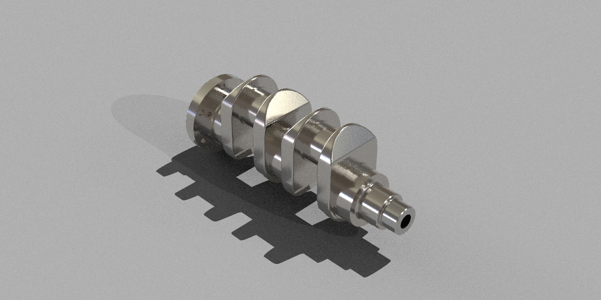

# Crankshaft Design | SolidWorks Project

## Project Overview

This repository contains a 3D crankshaft model designed in SolidWorks as part of mechanical engineering CAD practice. The project focuses on improving mechanical component modeling skills, feature creation workflow, and realistic rendering techniques.

---

## Project Preview

---

## Objectives

* Practice parametric CAD modeling
* Improve SolidWorks part design workflow
* Understand crankshaft geometry
* Enhance rendering and presentation skills
* Develop mechanical design fundamentals

---

## Software Used

* SolidWorks

---

## Features and Operations Used

* Revolve Boss/Base
* Extruded Boss/Base
* Fillet
* Chamfer
* Sketch Constraints
* Material Appearance
* Rendering

---

## Model Description

The model includes:

* Main shaft sections
* Crank webs
* Offset geometry
* Bearing journals
* Output shaft end

The design was created with smooth feature transitions and realistic proportions to resemble an actual mechanical crankshaft component.

---

## Learning Outcomes

Through this project, I improved:

* CAD sketching techniques
* Feature sequencing strategy
* Mechanical part visualization
* Rendering workflow
* Design accuracy and symmetry control

---

## Future Improvements

Planned improvements for this project include:

 Technical drawings
Motion analysis
Stress and fatigue analysis
 Assembly integration
 Manufacturing considerations

---

---

## Author

Affan Raza
Mechanical Engineering Student – UET Taxila

---

## Connect

* GitHub Portfolio
* LinkedIn Profile
* GrabCAD Projects
